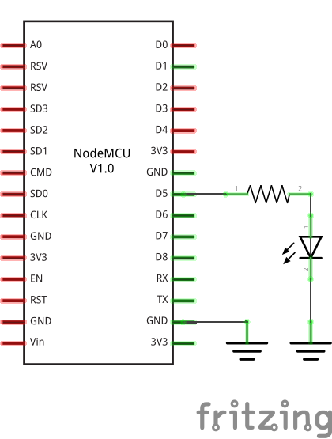
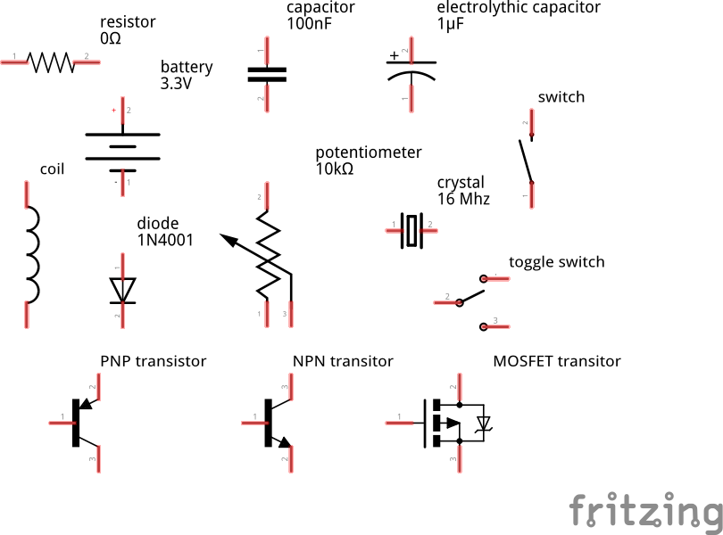
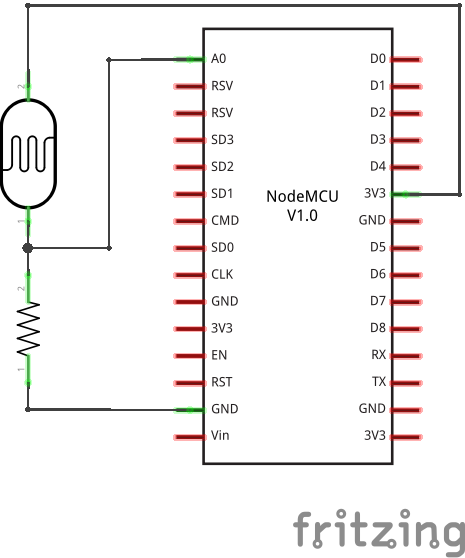
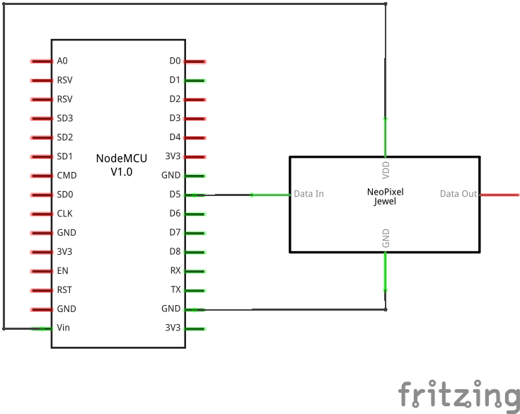
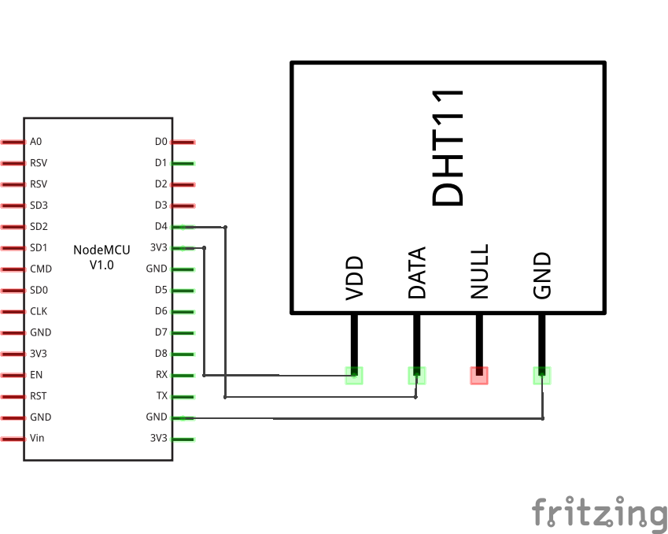
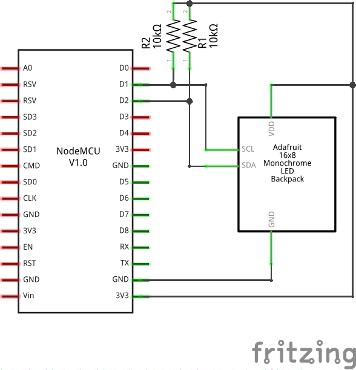

Advanced
********

Schematics
==========

The pretty colorful pictures that we have been using so far are not very
useful in practical projects. You can't really draw them by hand, different
components may look very similar, and it's hard to see what is going on when
there are a lot of connections. That's why engineers prefer to use more
symbolic representation of connection, a schematic.

A schematic doesn't care how the parts actually look like, or how their pins
are arranged. Instead they use simple symbols. For instance, here's a schematic
of our experiment with the external LED:

The resistor is symbolized by a zig-zag. The LED is marked by a diode symbol
(a triangle with a bar), with additional two arrows showing that it's a light
emitting diode. The board itself doesn't have a special symbol -- instead it's
symbolized by a rectangle with the board's name written in it.

There is also a symbol for "ground" -- the three horizontal lines. Since a lot
of components need to be usually connected to the ground, instead of drawing
all those wires, it's easier to simply use that symbol.

Here are some more symbols:

It's important to learn to read and draw electric schematics, because anything
more advanced is going to use them, and you will also need them when asking for
help on the Internet.

Analog to Digital Converter
===========================

Our board has only one "analog" pin, ``A0``. That pin is connected to an ADC,
or "analog to digital converter" -- basically an electronic voltmeter, which
can tell you what voltage is on the pin. The one we have can only measure from
0 to 1V, and would be damaged if it got more than 1V, so we have to be careful.

We will connect a photo-resistor to it. It's a special kind of a resistor that
changes its resistance depending on how much light shines on it. But to make
this work, we will need a second, fixed, resistor to make a "volatge divider".
This way the voltage will change depending on the resistance of our
photo-resistor.

Now, we will just read the values in our program, and print them in a loop::

    from machine import ADC
    adc = ADC(0)
    while True:
        print(adc.read())

You should see a column of numbers changing depending on how much light the
photo-resistor has. Try to cover it or point it toward a window or lamp. The
values are from 0 for 0V, to 1024 for 1V. Ours will be somewhere in between.

Communication Protocols
=======================

So far all devices we connected to the board were relatively simple and only
required a single pin. More sophisticated devices are controlled with multiple
pins, and often have very elaborate ways in which you have to change the pins
to make them do something, like sending a character to them, or retrieving a
value. Those ways are often standardized, and already implemented for you, so
that you don't have to care about all the gory details -- you just call
high-level commands, and the libraries and/or hardware in your board handles it
all for you.

Among the most popular protocols are UART, I²C and SPI. We are going to have
examples of each of them, but we are not going to get into details of how they
work internally. It's enough to know that they let you send bytes to the
device, and receive bytes in response.

Neopixels
=========

Those are actually WS2812B addressable RGB LEDs, but they are commonly known
as "neopixels". You can control individually the brightness and color of each
of the LEDs in a string (or matrix, or ring). The connection is simple:

And the code for driving them is not very complex either, because the library
for generating the signal is included in Micropython::

    form machine import Pin
    import neopixel
    pixels = neopixel.Neopixel(Pin(14, Pin.OUT), 8)
    pixels[0] = (0xff, 0x00, 0x00)
    pixels.write()

Where ``8`` is the number of LEDs in a chain.  You can create all sorts of
animations, rainbows and pretty effects with those.

Temperature and Humidity
========================

The DHT11 and DHT22 sensors are quite popular for all sorts of weather
stations. They use a single-wire protocol for communication. Micropython on
ESP9266 has that covered::

    from machine import Pin
    import dht
    sensor = dht.DHT11(Pin(2))
    sensor.measure()
    print(sensor.temperature())
    print(sensor.humidity())

The connections are simple:

LED Matrix and 7-segment Displays
=================================

Adafruit sells a lot of "backpacks" with 7- or 14-segment displays or LED
matrices, that we can control easily over I²C. They use a HT16K33 chip, so that
we don't have to switch on and off the individual LEDs -- we just tell the chip
what to do, and it takes care of the rest.

The schematic for connecting any I²C device will be almost always the same:

The communication with the backpack is relatively simple, but I wrote two
libraries for making it more convenient. For the matrix::

    from machine import I2C, Pin
    from ht16k33_matrix import Matrix8x8
    i2c = I2C(sda=Pin(4), scl=Pin(5))
    display = Matrix8x8(i2c)
    display.brightness(8)
    display.blink_rate(2)
    display.fill(True)
    display.pixel(0, 0, False)
    display.pixel(7, 0, False)
    display.pixel(0, 7, False)
    display.pixel(7, 7, False)
    display.show()

and for the 7- and 14-segment displays::

    from machine import I2C, Pin
    from ht16k33_seg import Seg7x4
    i2c = I2C(sda=Pin(4), scl=Pin(5))
    display = Seg7x4(i2c)
    display.push("8.0:0.8")
    display.show()
