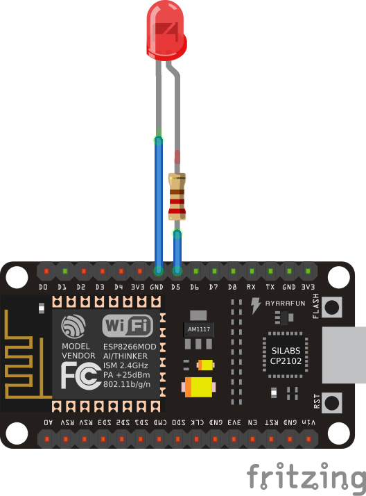
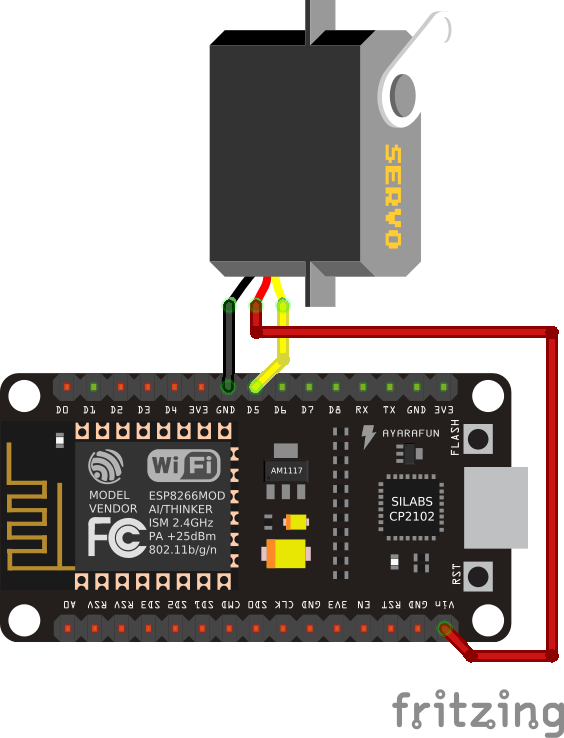
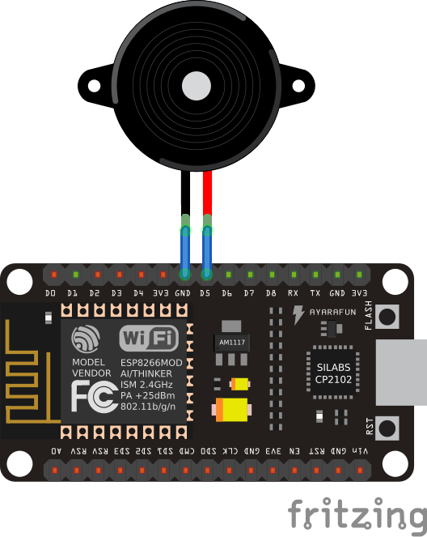

Basics
******

Blink
=====

The traditional first program for hobby electronics is a blinking light. We
will try to build that.

The boards you have actually have a light built-in, so we can use that. There
is a LED (light-emitting diode) near the antenna (the golden zig-zag). The plus
side of that LED is connected to the ``3v3`` pins internally, and the minus
side is connected to ``gpio2``. So we should be able to make that LED shine
with our program by making ``gpio2`` behave like the gnd pins. We need to
"bring the ``gpio2`` low", or in other words, make it connected to ``gnd``.
Let's try that::

    from machine import Pin

    led = Pin(2, Pin.OUT)
    led.low()

The first line "imports" the "Pin" function from the "machine" module. In
Python, to use any libraries, you first have to import them. The "machine"
module contains most of the hardware-specific functions in Micropython.

Once we have the "Pin" function imported, we use it to create a pin object,
with the first parameter telling it to use ``gpio2``, and the second parameter
telling it to switch it into output mode. Once created, the pin is assigned to
the variable we called "led".

Finally, we bring the pin low, by calling the "low" method on the "led"
variable. At this point the LED should start shining. In fact, it may have
started shining a line earlier, because once we switched the pin into output
mode, its default state is "low".

Now, how to make the LED stop shining? There are two ways. We could switch it
back into "input" mode, where the pin is not connected to anything. Or we could
bring it "high". If we do that, both ends of the LED will be connected to
"plus", and the current won't flow. We do that with::

    led.high()

Now, how can we make the LED blink 10 times? We could of course type
``led.low()`` and ``led.high()`` ten times quickly, but that's a lot of work
and we have computers to do that for us. We can repeat a command or a set of
commands using the "for" loop::

    for i in range(10):
        led.high()
        led.low()

Note, that when you are typing this, it will look more like::

    >>> for i in range(10):
    ...     led.high()
    ...     led.low()
    ...
    ...
    >>>

That's because the console automatically understands that when you indent a
line, you mean it to be a block of code inside the "for" loop. You have to
un-indent the last line (by removing the spaces with backspace) to finish this
command.

What happened? Nothing interesting, the LED just shines like it did. That's
because the program blinked that LED as fast as it could -- so fast, that we
didn't even see it. We need to make it wait a little before the blinks, and for
that we are going to use the "time" module. First we need to import it::

    import time

And then we will repeat our program, but with the waiting included::

    for i in range(10):
        led.high()
        time.sleep(0.5)
        led.low()
        time.sleep(0.5)

Now the LED should turn on and off every half second.

External Components
===================

Now let's try the same, but not with the build-in LED -- let's connect an
external LED and try to use that. The connection should look like this:

Note how one leg of the LED is a little bit longer, and the other had a
flattening on the plastic of the LED next to it. The long leg should go to the
plus, and the short one to the minus. We are connecting the LED in opposite way
than the internal one is connected -- between the pin and ``gnd``. That means
that it will shine when the pin is high, and be dark when it's low.

Also note how we added a resistor in there. That is necessary to limit the
amount of current that is going to flow through the LED, and with it, its
brightness. Without the resistor, the LED would shine very bright for a short
moment, until either it, or the board, would overheat and break. We don't want
that.

Now, let's try the code::

    from machine import Pin
    import time

    led = Pin(14, Pin.OUT)
    for i in range(10):
        led.high()
        time.sleep_ms(500)
        led.low()
        time.sleep_ms(500)

Again, you should see the LED blink 10 times, half a second for each blink.

This time we used ``time.sleep_ms()`` instead of ``time.sleep()`` -- it does
the same thing, but takes the number of milliseconds instead od seconds as the
parameter, so we don't have to use fractions.

Pulse Width Modulation
======================

Wouldn't it be neat if instead of blinking, the LED slowly became brighter and
then fade out again? Can we do this somehow?

The brightness of the LED depends on the voltage being supplied to it.
Unfortunately, our GPIO pins only have a simple switch functionality -- we
can turn them on or off, but we can't fluently change the voltage (there are
pins that could do that, called DAC, for "digital to analog converter", but
our board doesn't have those). But there is another way. Remember when we
first tried to blink the LED without any delay, and it happened too fast to
see?

Turns out we can blink the LED very fast, and by varying the time it is on and
off change how bright it seems to be to the human eye. The longer it is on and
the shorter it is off, the brighter it will seem.

Now, we could do that with a simple loop and some very small delays, but it
would keep our board busy and prevent it from doing anything else, and also
wouldn't be very accurate or terribly fast. But the ESP8266 has special
hardware dedicated just for blinking, and we can use that! This hardware is
called PWM (for Pulse Width Modulation), and you can use it like this::

    from machine import Pin, PWM
    import time

    pwm = PWM(Pin(2))
    pwm.duty(896)
    time.sleep(1)
    pwm.duty(512)
    time.sleep(1)
    pwm.duty(0)

If you run this, you should see the blue led on ``gpio2`` change brightness.
The possible range is from 1023 (100% duty cycle, the LED is off) to 0 (0%
duty cycle, the LED is on full brightness). Why is 0 full brightness? Remember,
that the LED on the ``gpio2`` is reversed -- it shines when the pin is off,
and the duty cycle tells how much the pin is on.

You can also change the frequency of the blinking. Try this::

    pwm.freq(1)

That should blink the LED with frequency of 1Hz, so once per second -- we are
basically back to our initial program, except the LED blinks "in the
background" controlled by dedicated hardware, while your program can do other
things!

Servomechanisms
===============

Time to actually physically move something. If you plan on building a robot,
there are three main ways of moving things from the microcontroller:

 * a servomechanism (servo for short),
 * an H-bridge and a DC motor,
 * a stepper or brushless motor with a driver.

We are going to focus on the servo first, because I think this is the easiest
and cheapest way. We are going to use a cheap "hobby" servo, the kind that is
used in toys -- it's not particularly strong, but it's enough for most use
cases.

.. warning::
    Don't try to force the movement of the servo arms with your hand, you are
    risking breaking the delicate plastic gears inside.

A hobby servo has three wires: brown or black ``gnd``, red or orange ``vcc``,
and white or yellow ``signal``. The ``gnd`` should of course be connected to
the ``gnd`` of our board. The ``vcc`` is the power source for the servo, and
we are going to connect it to the ``vin`` pin of our board -- this way it is
connected directly to the USB port, and not powered through the board.

.. caution::
    Servos and motors usually require a lot of current, more then your board
    can supply, and often even more than than you can get from USB. Don't
    connect them to the ``3v3`` pins of your board, and if you need two or
    more, power them from a battery (preferably rechargeable).

The third wire, ``signal`` tells the servo what position it should move to,
using a 50Hz PWM signal. The center is at around 77, and the exact range varies
with the servo model, but should be somewhere between 30 and 122, which
corresponds to about 180° of movement. Note that if you send the servo a signal
that is outside of the range, it will still obediently try to move there --
hitting a mechanical stop and buzzing loudly.  If you leave it like this for
longer, you can damage your servo, your board or your battery, so please be
careful.

So now we are ready to try and move it to the center position::

    from machine import Pin, PWM
    servo = PWM(Pin(14), freq=50, duty=77)

Then we can see where the limits of its movement are::

    servo.duty(30)
    servo.duty(122)

There also exist "continuous rotation" servos, which don't move to the
specified position, but instead rotate with specified speed. Those are suitable
for building simple wheeled robots. It's possible to modify a normal servo into
a continuous rotation servo.

Beepers
=======

When I wrote that PWM has a frequency, did you immediately think about sound?
Yes, electric signals can be similar to sound, and we can turn them into sound
by using speakers. Or small piezoelectric beepers, like in our case.

The piezoelectric speaker doesn't use any external source of power -- it will
be powered directly from the GPIO pin -- that's why it can be pretty quiet.
Still, let's try it::

    from machine import Pin, PWM
    import time

    beeper = PWM(Pin(14), freq=440, duty=512)
    time.sleep(0.5)
    beeper.deinit()

Unfortunately, we can't really play any melodies, as the possible frequencies
currently don't cover the musical notes. We can make noises, and that's pretty
much it.  We can play music and other sounds, but not with the PWM.

Network
=======

The ESP8266 has wireless networking support. It can act as a WiFi access point
to which you can connect, and it can also connect to the Internet.

To configure it as an access point, run code like this (use your own name and password)::

    import network
    ap = network.WLAN(network.AP_IF)
    ap.active(True)
    ap.config(essid="network-name", authmode=network.AUTH_WPA_WPA2_PSK, password="abcdabcdabcd")

To scan for available networks (and also get additional information about their
signal strength and details), use::

    import network
    sta = network.WLAN(network.STA_IF)
    sta.active(True)
    print(sta.scan())

To connect to an existing network, use::

    import network
    sta = network.WLAN(network.STA_IF)
    sta.active(True)
    sta.connect("network-name", "password")

Once the board connects to a network, it will remember it and reconnect every
time. To get details about connection, use::

    sta.ifconfig()
    sta.status()
    sta.isconnected()

WebREPL
=======

The command console in which you are typing all the code is called "REPL" --
an acronym of "read-evaluate-print-loop". It works over a serial connection
over USB. However, once you have your board connected to network, you can
use the command console in your browser, over network. That is called WebREPL.

First, you will need to download the web page for the WebREPL to your computer.
Get the file from https://github.com/micropython/webrepl/archive/master.zip and
unpack it somewhere on your computer, then click on the ``webrepl.html`` file
to open it in the browser.

In order to connect to your board, you have to know its address. If the board
works in accesspoint mode, it uses the default address. If it's connected to
WiFi, you can check it with this code::

    import network
    sta = network.WLAN(network.STA_IF)
    print(sta.ifconfig())

You will see something like ``XXX.XXX.XXX.XXX`` -- that's the IP address. Enter
it in the WebREPL's address box at the top like this
``ws://XXX.XXX.XXX.XXX:8266/``.

To connect to your board, you first have to start the server on it. You do it
with this code::

    import webrepl
    webrepl.start()

Now you can go back to the browser and click "connect".  On the first
connection, you will be asked to setup a password -- later you will use that
password to connect to your board.

Filesystem
==========

Writing in the console is all fine for experimenting, but when you actually
build something, you want the code to stay on the board, so that you don't have
to connect to it and type the code every time. For that purpose, there is a
file storage on your board, where you can put your code and store data.

You can see the list of files in that storage with this code::

    import os
    print(os.listdir())

You should see something like ``['boot.py']`` -- that's a list with just one
file name in it. ``boot.py`` and later ``main.py`` are two special files that
are executed when the board starts. ``boot.py`` is for configuration, and you
can put your own code in ``main.py``.

You can create, write to and read from files like you would with normal Python::

    with open("myfile.txt", "w") as f:
        f.write("Hello world!")
    print(os.listdir())
    with open("myfile.txt", "r") as f:
        print(f.read())

Please note that since the board doesn't have much memory, you can put large
files on it.

Uploading Files
===============

You can use the WebREPL to upload files to the board from your computer. To do
that, you need to open a terminal in the directory where you unpacked the
WebREPL files, and run the command:

.. code-block:: bash
    python webrepl_cli.py yourfile.xxx XXX.XXX.XXX.XXX:

Where ``yourfile.xxx`` is the file you want to send, and ``XXX.XXX.XXX.XXX`` is
the address of your board.

.. note::
    You have to have Python installed on your computer for this to work.

HTTP Requests
=============

Once you are connected to network, you can talk to servers and interact with
web services.
