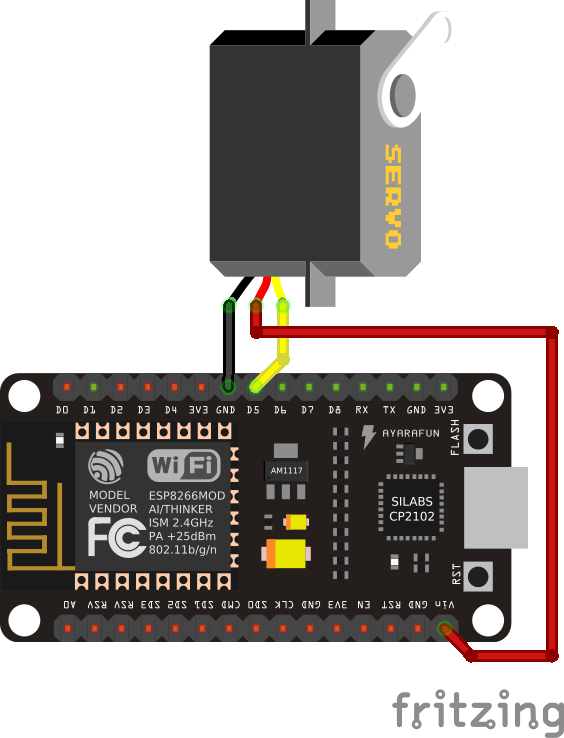

Servomechanisms
***************

Time to actually physically move something. If you plan on building a robot,
there are three main ways of moving things from the microcontroller:

 * a servomechanism (servo for short),
 * an H-bridge and a DC motor,
 * a stepper or brushless motor with a driver.

We are going to focus on the servo first, because I think this is the easiest
and cheapest way. We are going to use a cheap "hobby" servo, the kind that is
used in toys -- it's not particularly strong, but it's enough for most use
cases.

.. warning::
    Don't try to force the movement of the servo arms with your hand, you are
    risking breaking the delicate plastic gears inside.

A hobby servo has three wires: brown or black ``gnd``, red or orange ``vcc``,
and white or yellow ``signal``. The ``gnd`` should of course be connected to
the ``gnd`` of our board. The ``vcc`` is the power source for the servo, and
we are going to connect it to the ``vin`` pin of our board -- this way it is
connected directly to the USB port, and not powered through the board.

.. caution::
    Servos and motors usually require a lot of current, more then your board
    can supply, and often even more than than you can get from USB. Don't
    connect them to the ``3v3`` pins of your board, and if you need two or
    more, power them from a battery (preferably rechargeable).

The third wire, ``signal`` tells the servo what position it should move to,
using a 50Hz PWM signal. The center is at around 77, and the exact range varies
with the servo model, but should be somewhere between 30 and 122, which
corresponds to about 180° of movement. Note that if you send the servo a signal
that is outside of the range, it will still obediently try to move there --
hitting a mechanical stop and buzzing loudly.  If you leave it like this for
longer, you can damage your servo, your board or your battery, so please be
careful.

So now we are ready to try and move it to the center position::

    from machine import Pin, PWM
    servo = PWM(Pin(14), freq=50, duty=77)

Then we can see where the limits of its movement are::

    servo.duty(30)
    servo.duty(122)

There also exist "continuous rotation" servos, which don't move to the
specified position, but instead rotate with specified speed. Those are suitable
for building simple wheeled robots. It's possible to modify a normal servo into
a continuous rotation servo.
