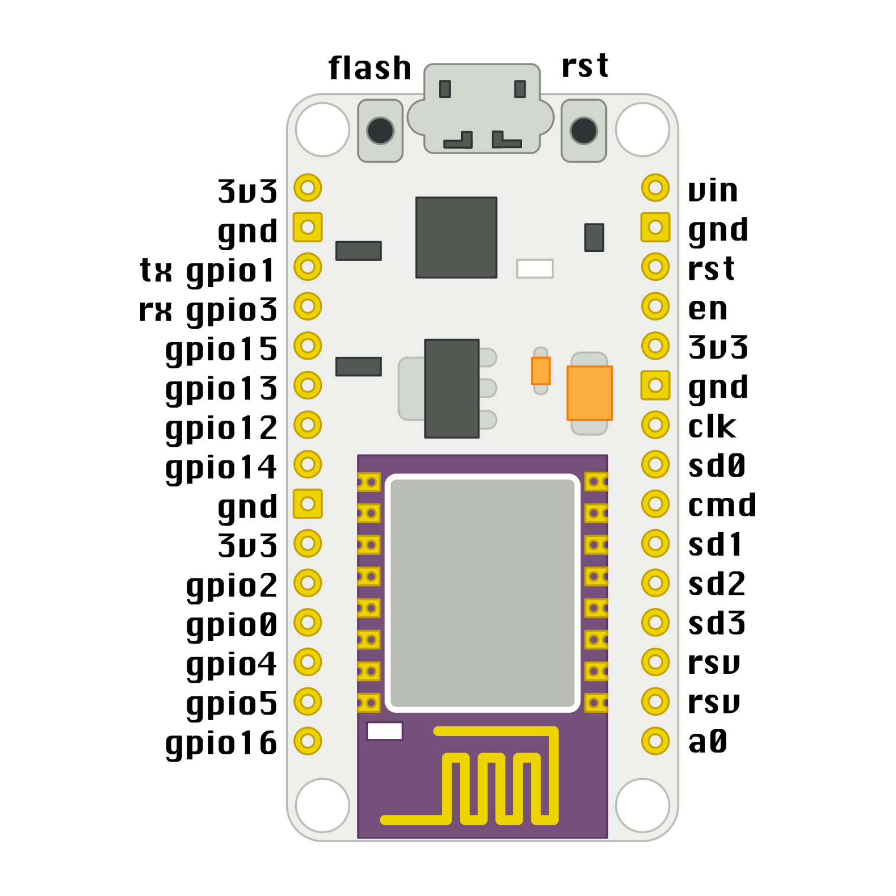

Setup
*****

Prerequisites
=============

To participate in the workshop, you will need the following:

  * A laptop with Linux, Mac OS or Windows and at least one free USB port.
  * If it's Windows or Mac OS, make sure to install `drivers`_ for the CP2102 UBS2TTL chip. MacOS El Capitan requires `disabling kext signing`_ to install it.
  * A micro-USB cable with data lines that fits your USB port.
  * You will need a terminal application installed. For Linux and Mac you can
    use ``screen``, which is installed by default. For Windows we recommend `PuTTy`_ or `CoolTerm`_.
  * Please note that the workshop will be in English.

.. _drivers: http://www.silabs.com/products/mcu/Pages/USBtoUARTBridgeVCPDrivers.aspx
.. _disabling kext signing: http://farazmemon.com/2016/02/07/flashing-latest-firmware-on-nodemcu-devkit-v0-9-osx-el-capitan/
.. _PuTTy: http://www.chiark.greenend.org.uk/~sgtatham/putty/download.html
.. _CoolTerm: http://freeware.the-meiers.org/

In addition, at the workshop, you will receive:
  * "NodeMCU AMICA" development board with ESP8266 on it,
  * Red LED,
  * 100Ω resistor,
  * SG90 microservo,
  * Female-female and Male-female dupont cables,
  * Piezoelectric speaker.

You will take all that home with you.

The firmware that is flashed on the boards is also available at https://bitbucket.org/thesheep/espworkshop/downloads/firmware-combined.bin

There will be also some additional hardware available for experimenting,
which you won't take home.

Development Board
=================

The board we are using is called "NodeMCU AMICA" and has an ESP8266 module
on it, which we will be programming. It comes with the latest version of
Micropython already setup on it, together with all the drivers we are going
to use.

.. note::
    The D0, D1, D2, ... numbers printed on the board are different from what
    Micropython uses -- because originally those boards were made for a
    different software. Make sure to refer to the image below to determine
    which pins are which.

On top it has a micro-USB socket, for connecting to the computer. Next to it
are two buttons, one for reset and one for flashing. Then on both sides of the
board are two rows of pins, to which we will be connecting cables.

The symbols meaning is as follows:

  * ``3v3`` - this is a fancy way to write 3.3V, which is the voltage that the
    board runs on internally. You can think about this pin like the plus side
    of a battery. There are several pins like this, they are all connected
    inside.
  * ``gnd`` - this is the ground. Think about it like the minus side of the
    battery. They are also all connected.
  * ``gpioXX`` - "gpio" stands for "general purpose input output". Those are
    the pins we will be using for sending and receiving signals to and from
    various devices that we will connect to them. They can act as output --
    pretty much like a switch that you can connect to plus or to minus with
    your program.  Or they can act as input, telling your program whether they
    are connected to plus or minus.
  * ``a0`` - this is the analog pin. It can measure the voltage that is applied
    to it, but it can only handle up to 1V.
  * ``vin`` - this pin is connected with the 5V from your computer. You can
    also use it to power your board with a battery when it's not connected to
    the computer. The voltage applied here will be internally converted to the
    3.3V that the board needs.
  * ``rst`` - this is a reset button (and a corresponding pin, to which you can
    connect external button).
  * ``flash`` - hold down this button while resetting to bring the board into
    programming mode (also known as flashing mode).

The other pins are used internally by the board, and we will not be connecting
anything to them.

Connecting
==========

The board you got should already have Micropython with all the needed libraries
flashed on it. In order to access its console, you will need to connect it to
your computer with the micro-USB cable, and access the serial interface that
appears with a terminal program.

Linux and MacOS
---------------

Simply open a terminal and run the following commands. On Linux::

    screen /dev/ttyUSB0 115200

On MacOS::

    screen /dev/tty.SLAB_USBtoUART 115200

To exit screen, press ctrl+A and then capital K.

Windows
-------

For the serial interface to appear in your system, you will need to install the drivers_ for CP2102. Once you have that, you can use either Hyper Terminal, PuTTy or CoolTerm to connect to it, following this guide_.

The parameters for the connection are: 115200 baud rate, 8 data bits, no parity, 1 stop bit, no flow control.

Hello world!
------------

Once you are connected, press "enter" and you should see the Micropython prompt, that looks like this::

    >>>

It's traditional to start with a "Hello world!" program, so type this and press "enter"::

    print("Hello world!")

If you see "Hello world!" displayed in the next line, then congratulations, you got it working.

.. _guide: https://techawarey.wordpress.com/tag/serial-port-communication-in-windows-7-using-hyper-terminal-and-putty/

Official Documentation and Support
==================================

The official documentation for this port of Micropython is available at
http://micropython.org/resources/docs/en/latest/esp8266/. There is a also a
forum on which you can ask questions and get help, located at
http://forum.micropython.org/. Finally, there are ``#esp8266`` and
``#micropython`` channels on http://freenode.net IRC network, where people chat
in real time. Remember that all people there are just users like you, but
possibly more experienced, and not employees who get paid to help you.
